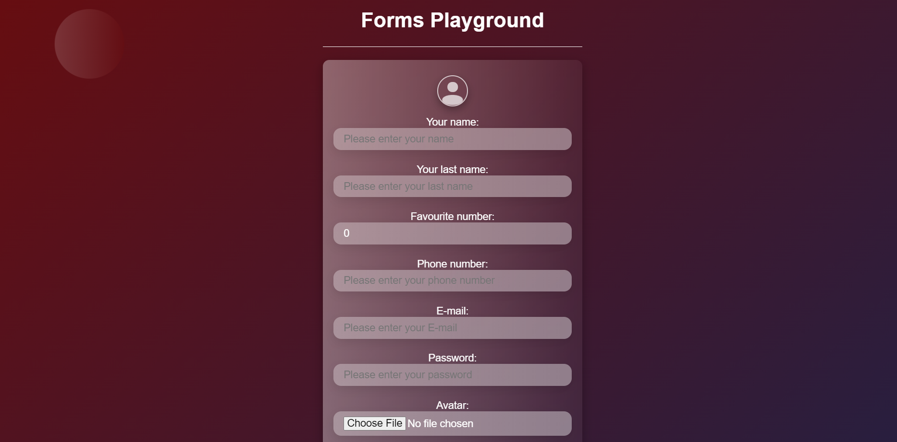

# web-form

My simple web-form page.
See live view [web-form](https://kamil-siwiec.github.io/web-form/)

## Technologies & tools used:
- HTML5, BEM,
- CSS3, Flexbox,
- JavaScript

## Scripts:
```javascript
const headingTl = gsap.timeline ({
  repeat: -1,
  repeatDelay: 2,
  yoyo: true
});

headingTl
  .from(".heading", {
    duration: 1,
    scaleX: 0,
    transformOrigin: "left",
    ease: "expo.inOut"
  })
  .from(
    ".heading h1",
    {
      y: "150%",
      duration: 0.8,
      ease: "expo.out"
    },
    "-=0.2"
  )
  .from(
    ".heading",
    {
      css: { borderBottom: "2px solid #670d10" },
      duration: 2,
      transformOrigin: "right",
      ease: "none"
    },
    "-=1"
  )
  .from(
    ".heading h1",
    {
      duration: 2,
      transformOrigin: "right",
      ease: "none",
      css: { color: "#670d10" }
    },
    "-=2"
  );
```
